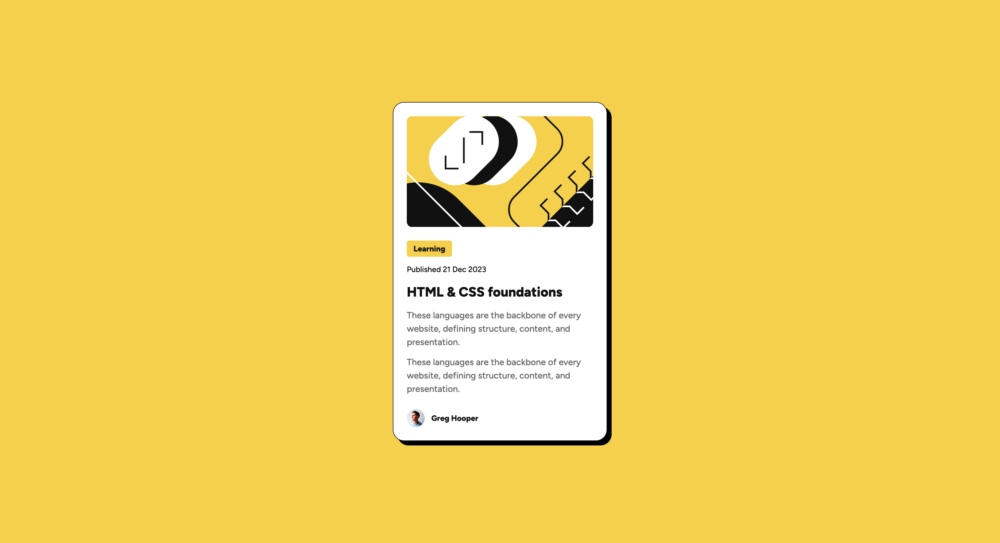

# Frontend Mentor - Blog preview card solution

This is a solution to the [Blog preview card challenge on Frontend Mentor](https://www.frontendmentor.io/challenges/blog-preview-card-ckPaj01IcS). Frontend Mentor challenges help you improve your coding skills by building realistic projects. 

## Table of contents

- [Overview](#overview)
  - [The challenge](#the-challenge)
  - [Screenshot](#screenshot)
  - [Links](#links)
- [My process](#my-process)
  - [Built with](#built-with)
  - [What I learned](#what-i-learned)
  - [Useful resources](#useful-resources)
- [Author](#author)

## Overview

### The challenge

Users should be able to:

- See hover and focus states for all interactive elements on the page

### Screenshot



### Links

- Solution URL: [github.com/jyeharry/blog-preview-card](https://github.com/jyeharry/blog-preview-card)
- Live Site URL: [jyeharry.github.io/blog-preview-card/](https://jyeharry.github.io/blog-preview-card/)

## My process

### Built with

- Semantic HTML5 markup
- CSS custom properties
- Flexbox

### What I learned

I learnt how to declare variable fonts in CSS:

```css
@font-face {
  font-family: 'Figtree';
  src: url('../assets/fonts/Figtree-VariableFont_wght.ttf') format('truetype');
  font-weight: 100 900;
  font-style: normal;
}
```

I also took accessibility into consideration by using more semantic html tags and attributes such as the `aria-labelledby` attribute on the surrounding `<a>` around the card.

I was about to submit my solution then I realised the challenge page mentions that the font size is different on the mobile design and that I should find a way to reduce the font size without using media queries. This is where I first used `clamp()`!

To come up with the dynamic value (the second value in `clamp()`), I divided the mobile font size by the mobile screen width. So for example, the body text had to be 14px on mobile and the mobile screen size is 375px. So 14 / 375 = 0.0373. So the dynamic value I used in `clamp()` was 3.75vw. I'm not sure if this is the best way to come up with the value but it worked well enough for all the different text presets in this challenge.

### Useful resources

- [developer.mozilla.org/](https://developer.mozilla.org/) - I mainly just used various pages on MDN.

## Author

- Website - [Jye Harry](https://jyeharry.github.io/)
- Frontend Mentor - [@jyeharry](https://www.frontendmentor.io/profile/jyeharry)

